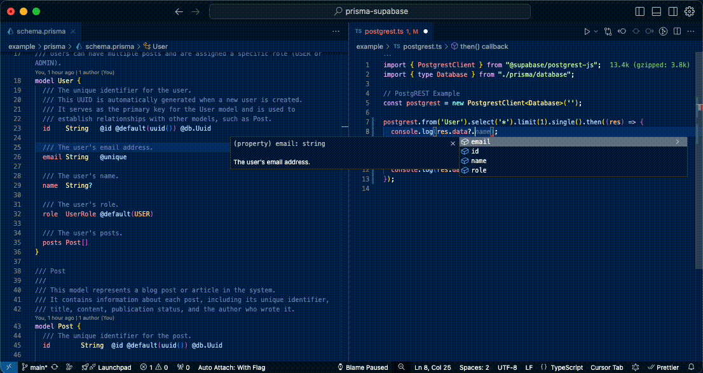

# Prisma Supabase Generator

A Prisma generator that creates types for the [@supabase/supabase-js](https://github.com/supabase/supabase-js) or [@supabase/postgrest-js](https://github.com/supabase/postgrest-js) client without the need for an online or dockerized database, resulting in faster generation times. This is particularly useful for projects that only use PostgREST.

<!-- Attach Image from Assets -->


## Installation

To use this generator, add it to your Prisma project. First, install the package:

NPM
```sh
npm i -D prisma-supabase
```

Yarn
```sh
yarn add -D prisma-supabase
```

PNPM
```sh
pnpm add -D prisma-supabase
```

Deno 2.x
```sh
deno add -D prisma-supabase
```

Bun
```sh
bun add -D prisma-supabase
```

## Usage

1. Add the generator to your `schema.prisma` file:

```prisma
generator supabase {
  provider = "prisma-supabase"
  output   = "./database.ts" // Optional: Defaults to ./database.ts which would store in ./prisma/database.ts
  enableDocumentation = true // Optional: Defaults to true
}
```

2. Run Prisma generate to create the Supabase types:

```bash
npx prisma generate
```

This will generate a `database.ts` file (or whatever you specified in the `output` option) in your Prisma output directory (usually `prisma/`).

### Configuration Options

- `output`: Specifies the output file for the generated types. Defaults to `./prisma/database.ts`.
- `enableDocumentation`: Enables or disables the generation of JSDoc comments from Prisma schema comments. Defaults to `true`.

## Example Usage

Here's an example of how to use the generated types with Supabase:

```typescript
import { createClient } from "@supabase/supabase-js";
import { type Database } from "./prisma/database";

// Supabase Example
const supabase = createClient<Database>('', '');

supabase.from('User').select('*').limit(1).single().then((res) => {
  console.log(res.data?.id);
});

supabase.from('User').select('*, Post(*)').limit(1).single().then((res) => {
  console.log(res.data?.Post[0].content);
});

```

Or using [PostgREST](https://postgrest.org/):

```typescript
import { PostgrestClient } from "@supabase/postgrest-js";
import { type Database } from "./prisma/database";

// PostgREST Example
const postgrest = new PostgrestClient<Database>('');

postgrest.from('User').select('*').limit(1).single().then((res) => {
  console.log(res.data?.id);
});

postgrest.from('User').select('*, Post(*)').limit(1).single().then((res) => {
  console.log(res.data?.Post[0].content);
});

```

In these examples, the `Database` type is imported from the generated `database.ts` file, providing type safety for your Supabase or PostgREST queries based on your Prisma schema.

## Example Output
**Schema**: [example/prisma/schema.prisma](./example/prisma/schema.prisma)

**Output**: [example/prisma/database.ts](./example/prisma/database.ts)

## Features

- [x] Table Types
- [x] Table Relationships
- [x] Enum Types
- [x] JSDoc from Prisma schema comments
- [x] View Types (included within Table Types)
- [ ] Multiple Schemas (in progress)
- [ ] Composite Types (not supported by Prisma yet)
- [ ] Function Types (not supported by Prisma yet)

## Benefits

- Generate [Supabase](https://supabase.com/) types from your [Prisma](https://www.prisma.io/) schema without an online or dockerized database
- Useful for projects that only use [PostgREST](https://postgrest.org/)
- Faster type generation process
- Optional JSDoc comments for better code documentation

## Requirements

- Prisma 2.x or higher

## Contributing

Contributions are welcome! Please feel free to submit a Pull Request or open an Issue.

## License

This project is licensed under the MIT License.
